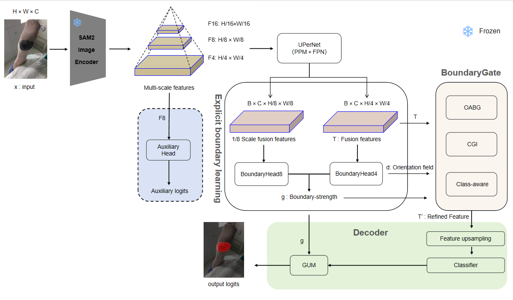
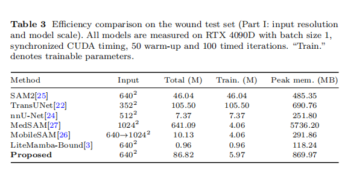
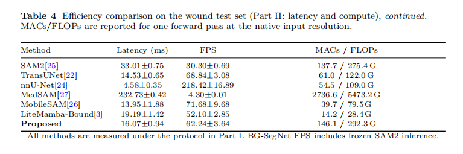
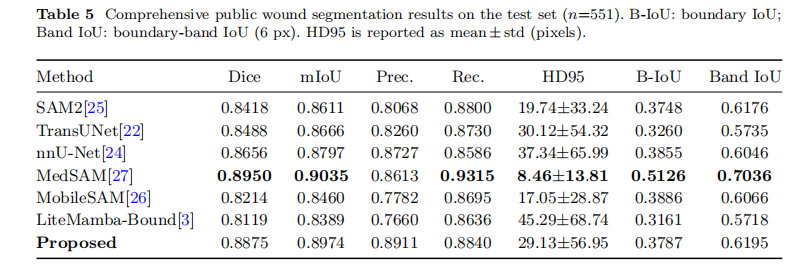
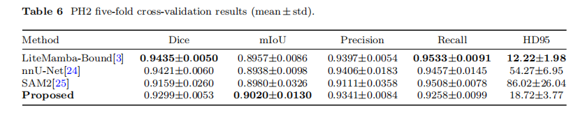

# BG-SegNet: Boundary-Gated SAM2 for Boundary-Precise Medical Image Segmentation

This repository provides the **official implementation** of the manuscript  
**"BG-SegNet: Boundary-Gated SAM2 for Boundary-Precise Medical Image Segmentation"**,  
submitted to *The Visual Computer*. The code, pretrained weights, and evaluation results in this repository are **directly related** to the above manuscript. If you use this code or models in your research, please consider citing our paper (see the [Citation](#citation) section).

Medical image segmentation is crucial for clinical analysis, yet it faces challenges such as ill-defined boundaries and the need for real-time processing. This paper introduces **BG-SegNet** (Boundary-Gated Segmentation Network), a lightweight framework built on the principle of **geometry-driven, spatially selective refinement**. BG-SegNet integrates a frozen SAM2 encoder with an explicit boundary-aware gating mechanism: multi-scale features are aggregated, boundary strength and orientation fields are predicted, and the resulting cues gate orientation-aware anisotropic convolutions (OABG) and residual updates only near ambiguous or high-curvature contours. Confidence-guided inhibition (CGI) and class-aware modulation further suppress unreliable corrections in artifact-prone regions, while boundary-guided content-aware upsampling (GUM) promotes sharper final contours. On a comprehensive public wound benchmark (2,759 images; 551 test images), BG-SegNet achieves competitive segmentation accuracy with a favorable accuracy–efficiency trade-off; on PH2, it attains the best mean IoU and substantially lower HD95 than nnU-Net and SAM2.

- **Wound dataset**: [https://doi.org/10.5281/zenodo.18774944](https://doi.org/10.5281/zenodo.18774944)
- **Code archive**: [https://doi.org/10.5281/zenodo.18774504](https://doi.org/10.5281/zenodo.18774504)

## Architecture

BG-SegNet follows an **explicit boundary learning + boundary-gated residual refinement** design:

1. **Frozen SAM2.1 Hiera-B+ encoder** extracts multi-scale pyramid features \(\{F_4, F_8, F_{16}\}\).
2. **UPerNet neck (PPM + FPN)** fuses them into a quarter-resolution tensor \(T\) and an eighth-resolution map \(P_8\).
3. **BoundaryHead** predicts boundary strength logits and an orientation field from \(T\) and \(P_8\); multi-scale cues are aggregated into a single-channel gating map \(g\).
4. **BoundaryGate** refines \(T\) using \(g\), the orientation field, OABG, CGI, and class-aware modulation.
5. The **decoder** produces coarse full-resolution logits; **GUM** refines them using the upsampled boundary map as a spatial guide.

Training-only components (auxiliary deep supervision on \(F_8\), curriculum boundary-loss warm-up, and progressive gate-unfreezing) stabilize optimization but are disabled at inference.



## Results

### Wound test set (\(n = 551\), \(640 \times 640\))

| Metric | BG-SegNet |
|--------|-----------|
| Dice | 0.8875 |
| mIoU | 0.8974 |
| Precision | 0.8911 |
| Recall | 0.8840 |
| Boundary-band IoU (6 px) | 0.6205 |
| B-IoU | 0.3800 |
| HD95 (px) | 32.06 |

### Efficiency (RTX 4090D, batch size 1, synchronized CUDA timing)

| Metric | BG-SegNet |
|--------|-----------|
| Total parameters | 86.82 M |
| Trainable parameters | 5.97 M |
| Peak GPU memory | 869.97 MB |
| Latency | 15.97 ± 0.09 ms |
| Throughput | 62.62 ± 0.36 FPS |
| MACs / FLOPs | 146.1 / 292.3 G |

### PH2 (5-fold cross-validation, patient-independent)

| Metric | BG-SegNet |
|--------|-----------|
| Dice | 0.9299 ± 0.0053 |
| mIoU | **0.9020 ± 0.0130** |
| Precision | 0.9341 ± 0.0084 |
| Recall | 0.9258 ± 0.0099 |
| HD95 (px) | 18.72 ± 3.77 |







## Datasets

### Comprehensive Public Wound Segmentation Benchmark

The primary wound benchmark comprises **2,759 images** assembled from WSNet, the FUSC Foot Ulcer Challenge, and the Medetec wound database. After source-wise deduplication, removal of unannotated or corrupted samples, and exclusion of near-duplicate crops, the dataset is split into **1,766 training**, **442 validation**, and **551 test** images. Images are resized to \(640 \times 640\) and normalized with ImageNet statistics.

The released annotations follow the **YOLO segmentation format** (`yolo_seg`). Download the prepared dataset from [Zenodo](https://doi.org/10.5281/zenodo.18774944).

#### Directory Structure

```
/path/to/yolo_seg
  ├── train
  │   ├── images
  │   │   ├── xxx1.jpg / .png
  │   │   └── ...
  │   └── labels
  │       ├── xxx1.txt
  │       └── ...
  ├── val
  │   ├── images
  │   └── labels
  └── test
      ├── images
      └── labels
```

#### Label Format

Each label file `xxx.txt` contains polygon annotations in YOLO format:

```
class_id x1 y1 x2 y2 x3 y3 ...
```

- Normalized coordinates (0–1)
- At least 3 vertices per polygon
- `class_id = 0` for background, `class_id = 1` for foreground (wound/lesion)

The dataset loader (`src/data/dataset_mask.py`) converts YOLO polygons to dense binary masks automatically.

### PH2 Dermoscopic Lesion Dataset

We also evaluate on the [PH2 dataset](https://doi.org/10.1109/EMBC.2013.6610779) with **patient-independent 5-fold cross-validation** (200 images, \(\approx\)40 images per fold). Dermoscopic images are resized to \(192 \times 256\). See `train_ph2_5fold.py` and `config_ph2.yaml` for the cross-validation setup.

---

## Installation

### Requirements

- Python ≥ 3.9
- PyTorch ≥ 2.0 (with CUDA recommended)
- Dependencies:
  ```bash
  pip install torch torchvision numpy opencv-python albumentations \
              tqdm tensorboard Pillow hydra-core omegaconf scipy \
              scikit-image scikit-learn
  ```
- We recommend creating a fresh virtual environment and installing dependencies via:
  ```bash
  pip install -r project/requirements.txt
  ```

### SAM2 Weights

1. Download **SAM2.1 Hiera B+** weights ([Hugging Face](https://huggingface.co/facebook/sam2.1-hiera-base-plus)):
   - Model checkpoint: `sam2.1_hiera_base_plus.pt`
   - Place in a directory accessible by `model.sam2_path` in `config.yaml`

2. SAM2 Configuration:
   - Ensure Hydra config files are available under `third_party/sam2/sam2/configs/`
   - Update `model.sam2_path` in `config.yaml` to point to the SAM2 directory

---

## Usage

Configuration files (`config.yaml` for the wound dataset and `config_ph2.yaml` for PH2) are included in this repository and match the hyperparameters reported in the manuscript.

### Training

**Basic training on the wound segmentation dataset:**

```bash
cd project/bgsegnet
python train.py --config config.yaml
```

**Resume from checkpoint:**

```bash
python train.py --config config.yaml --resume runs/<experiment>/weights/last.pth
```

**Validation only:**

```bash
python train.py --config config.yaml --eval
```

**5-fold cross-validation (PH2):**

```bash
python train_ph2_5fold.py --config config_ph2.yaml --ph2_root /path/to/PH2
```

### Evaluation

**Evaluate on test set:**

```bash
python -m src.evaluate_csegnet \
  --config config.yaml \
  --checkpoint best.pth \
  --data_root /path/to/yolo_seg \
  --output_dir evaluation_results \
  --batch_size 16
```

**Single-image inference:**

```bash
python infer_single_image.py \
  --config config.yaml \
  --checkpoint best.pth \
  --image /path/to/input.png \
  --out /path/to/output_mask.png \
  --threshold 0.5
```

## Pretrained Weights and Evaluation Results

- **Pretrained checkpoint**: `best.pth` (trained on the wound test benchmark used in the paper).
- **Evaluation results**: `evaluation_results/`
  - `evaluation_metrics.json`: segmentation metrics on the wound test set.
  - `efficiency_bg_segnet.json`: parameter counts, MACs/FLOPs, and synchronized single-GPU latency/throughput.
  - `comparison_images/`: qualitative comparisons on the test set.

To reproduce the test-time evaluation using the provided checkpoint:

```bash
cd project/bgsegnet
python -m src.evaluate_csegnet \
  --config config.yaml \
  --checkpoint ../../best.pth \
  --data_root /path/to/yolo_seg \
  --output_dir ../../evaluation_results_reproduced \
  --batch_size 16
```

## Code Structure

```
project/bgsegnet/
  ├── config.yaml                 # Main configuration for the wound dataset
  ├── config_ph2.yaml             # PH2 configuration (5-fold CV)
  ├── train.py                    # Main training script for the wound dataset
  ├── train_ph2_5fold.py          # 5-fold CV training for PH2
  ├── infer_single_image.py       # Single-image inference
  └── src/
      ├── config/loader.py        # YAML config loader
      ├── data/
      │   ├── dataset_mask.py     # YOLO polygon → mask dataset (wound)
      │   └── dataset_mask_ph2.py # PH2 mask dataset
      ├── engine/
      │   ├── trainer.py          # Training loop with boundary curriculum & gate unfreezing (wound)
      │   ├── trainer_ph2.py      # Training loop for PH2
      │   ├── metrics.py          # Comprehensive evaluation metrics
      │   └── metrics_unit.py
      ├── losses/
      │   └── seg_losses.py       # Segmentation + unified soft boundary-band loss
      ├── models/
      │   ├── sam2_loader.py      # SAM2 loading & feature extraction (frozen encoder)
      │   ├── cseg_net.py         # BG-SegNet main model (inference path: SAM2 → UPerNet → BoundaryHead → BoundaryGate → decoder → GUM)
      │   ├── neck/ppm.py         # UPerNet (PPM + FPN) neck
      │   └── heads/
      │       ├── decoder_head.py  # Main decoder + GUM (boundary-guided upsampling)
      │       ├── boundary_head.py # BoundaryHead: strength + orientation prediction
      │       └── boundary_gate.py # BoundaryGate: OABG, CGI, class-aware residual refinement
      └── utils/logger.py         # TensorBoard & CSV logging
```

Key configuration flags (see `config.yaml`):

| Component | Config flag |
|-----------|-------------|
| BoundaryHead + soft boundary-band supervision | `boundary.enable` |
| BoundaryGate (OABG, adaptive \(\alpha\)) | `boundary.oabg_enable`, `boundary.adaptive_alpha` |
| CGI (ambiguity-aware inhibition) | `boundary.u_aware_alpha` |
| Class-aware modulation | `boundary.class_mixing` |
| GUM | `head.gum` |
| Auxiliary deep supervision (training only) | `head.aux_loss` |
| Progressive gate-unfreezing (training only) | `boundary.gate.grad_unfreeze_epoch` |

## Citation

If you find this repository useful in your research, please consider citing our paper:

```bibtex
@article{Li2025BGSegNet,
  title   = {BG-SegNet: Boundary-Gated SAM2 for Boundary-Precise Medical Image Segmentation},
  author  = {Bo Li and Ran Tian},
  journal = {The Visual Computer},
  year    = {2025},
  note    = {Under review},
  % doi   = {10.XXXX/XXXXX}  % To be updated after acceptance
}
```
