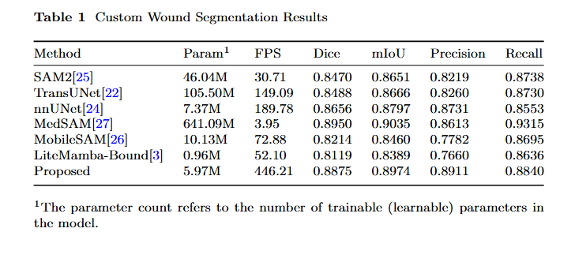

# BG-SegNet: Efficient Boundary Optimization and Real-Time Inference for Wound Image Segmentation

Medical image segmentation remains challenging due to ill-defined boundaries, heterogeneous lesion morphology, and the need for real-time inference in clinical workflows. Existing approaches often trade boundary fidelity for efficiency, or rely on large-scale models with prohibitive computational cost. We propose **BG-SegNet** (Boundary-Gated Segmentation Network), a lightweight framework that couples a frozen SAM2 encoder with an explicit boundary-aware gating mechanism. The network aggregates multi-scale features into a compact representation, predicts boundary strength and orientation fields under soft boundary-band supervision, and uses them as spatial gating signals to drive orientation-aware anisotropic convolutions only where refinement is required. Uncertainty-aware modulation further suppresses artifact-induced noise, and a progressive gradient-unfolding strategy facilitates stable joint optimization of semantic and boundary representations. On a custom wound segmentation dataset, BG-SegNet achieves high Dice and mIoU while running at several hundred frames per second, offering a markedly better accuracy–efficiency trade-off than heavier foundation-model baselines. On the PH2 dermoscopic lesion dataset, it attains competitive performance compared with specialized skin-lesion architectures, indicating strong cross-domain generalization.




## Datasets

### Custom Wound Segmentation Dataset

The primary dataset used in this work follows the **YOLO segmentation format** (`yolo_seg`).

#### Directory Structure

```
/path/to/yolo_seg
  ├── train
  │   ├── images
  │   │   ├── xxx1.jpg / .png
  │   │   └── ...
  │   └── labels
  │       ├── xxx1.txt
  │       └── ...
  ├── val
  │   ├── images
  │   └── labels
  └── test
      ├── images
      └── labels
```

#### Label Format

Each label file `xxx.txt` contains polygon annotations in YOLO format:
```
class_id x1 y1 x2 y2 x3 y3 ...
```
- Normalized coordinates (0–1)
- At least 3 vertices per polygon
- `class_id = 0` for background, `class_id = 1` for foreground (wound/lesion)

The dataset loader (`src/data/dataset_mask.py`) converts YOLO polygons to dense binary masks automatically.

### PH2 Dermoscopic Lesion Dataset

We also evaluate on the PH2 dataset. See `train_ph2_5fold.py` for 5-fold cross-validation setup.

---

## Installation

### Requirements

- Python ≥ 3.9
- PyTorch ≥ 2.0 (with CUDA recommended)
- Dependencies:
  ```bash
  pip install torch torchvision numpy opencv-python albumentations \
              tqdm tensorboard Pillow hydra-core omegaconf scipy \
              scikit-image scikit-learn
  ```

### SAM2 Weights

1. Download **SAM2.1 Hiera B+** weights (https://huggingface.co/facebook/sam2.1-hiera-base-plus):
   - Model checkpoint: `sam2.1_hiera_base_plus.pt`
   - Place in a directory accessible by `model.sam2_path` in `config.yaml`

2. SAM2 Configuration:
   - Ensure Hydra config files are available under `third_party/sam2/sam2/configs/`
   - Update `model.sam2_path` in `config.yaml` to point to the SAM2 directory

---

## Usage

Configuration files will be uploaded after acceptance.

### Training

**Basic training on YOLO segmentation dataset:**

```bash
cd /path/to/project/bgsegnet
python train.py --config config.yaml
```

**Resume from checkpoint:**

```bash
python train.py --config config.yaml --resume runs/<experiment>/weights/last.pth
```

**Validation only:**

```bash
python train.py --config config.yaml --eval
```

**5-fold cross-validation (PH2):**

```bash
python train_ph2_5fold.py --config config_ph2_best.yaml --ph2_root /path/to/PH2
```

### Evaluation

**Evaluate on test set:**

```bash
python -m src.evaluate_csegnet \
  --config config.yaml \
  --checkpoint runs/<experiment>/weights/best.pth \
  --data_root /path/to/yolo_seg \
  --output_dir evaluation_results \
  --batch_size 16
```

**Single-image inference:**

```bash
python infer_single_image.py \
  --config config.yaml \
  --checkpoint runs/<experiment>/weights/best.pth \
  --image /path/to/input.png \
  --out /path/to/output_mask.png \
  --threshold 0.5
```

## Code Structure

```
bgsegnet/
  ├── config.yaml                 # Main configuration for yolo_seg
  ├── config_ph2_best.yaml        # PH2 configuration
  ├── train.py                    # Main training script
  ├── train_ph2_5fold.py          # 5-fold CV for PH2
  ├── infer_single_image.py       # Single-image inference
  └── src/
      ├── config/loader.py        # YAML config loader
      ├── data/
      │   └── dataset_mask.py     # YOLO polygon → mask dataset
      ├── engine/
      │   ├── trainer.py          # Training loop with boundary curriculum
      │   └── metrics.py          # Comprehensive evaluation metrics
      ├── losses/
      │   └── seg_losses.py       # Segmentation + unified soft boundary loss
      ├── models/
      │   ├── sam2_loader.py      # SAM2 loading & feature extraction
      │   ├── cseg_net.py         # BG-SegNet main model
      │   ├── neck/ppm.py         # UPerNet (PPM + FPN)
      │   └── heads/
      │       ├── decoder_head.py # Main decoder + GUM
      │       ├── boundary_head.py # Boundary prediction head
      │       └── boundary_gate.py # Boundary-gated refinement module
      └── utils/logger.py         # TensorBoard & CSV logging
  
```
